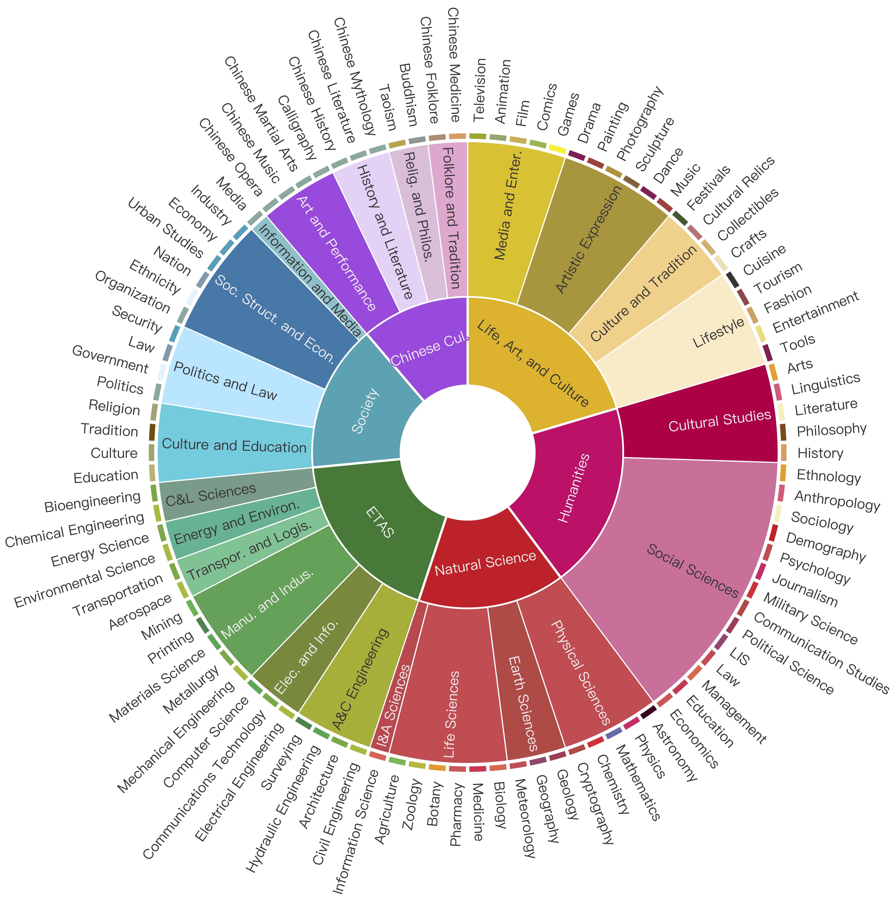

# Overview


**Chinese SimpleQA** is the first comprehensive Chinese benchmark to evaluate the factuality ability of language models to answer short questions, and Chinese SimpleQA mainly has five properties (i.e., Chinese, Diverse, High-quality, Static, Easy-to-evaluate). Specifically, our benchmark covers **6 major topics** with **99 diverse subtopics**. 


> This is the evaluation repository for Chinese SimpleQA, which is forked from OpenAI's [simple-evals](https://github.com/openai/simple-evals), and it follows the MIT License.

<p align="center">
  
</p>


## 💫 Instroduction

* How to solve the generative hallucination of models has always been an unsolved problem in the field of artificial intelligence (AI). In order to measure the factual correctness of language models, OpenAI recently released and open-sourced a test set called SimpleQA. We have also been paying attention to the field of  factuality, which currently has problems such as outdated data, inaccurate evaluation, and incomplete coverage. For example, the knowledge evaluation sets widely used now are still CommonSenseQA, CMMLU, and C-Eval, which are multiple-choice question-based evaluation sets. **In order to further promote the research of the Chinese community on the factual correctness of models, we propose the Chinese SimpleQA**.  which consists of 3000 high-quality questions spanning 6 major topics, ranging from humanities to science and engineering. Specifically, the distinct main features of our proposed Chinese SimpleQA dataset are as follows:
  * 🀄**Chinese:** Our Chinese SimpleQA focuses on the Chinese language, which provides a comprehensive evaluation of the factuality abilities of existing LLMs in Chinese.
  * 🍀**Diverse:** Chinese SimpleQA covers 6 topics (i.e., “Chinese Culture”, “Humanities”, “Engineering, Technology, and Applied Sciences”, “Life, Art, and Culture”, “Society”, and “Natural Science”), and these topic includes 99 fine-grained subtopics in total, which demonstrates the diversity of our Chinese SimpleQA. 
  * ⚡**High-quality:** We conduct a comprehensive and rigorous quality control process to ensure the quality and accuracy of our Chinese SimpleQA.
  * 💡**Static:** Following SimpleQA, to preserve the evergreen property of Chinese SimpleQA, all reference answers would not change over time. 
  * 🗂️**Easy-to-evaluate:** Following SimpleQA, as the questions and answers are very short, the grading procedure is fast to run via existing LLMs (e.g., OpenAI API).

- Based on Chinese SimpleQA, we have conducted a comprehensive evaluation of the factual capabilities of existing LLMs. We also maintain a comprehensive leaderboard list. 
- In short, we hope that Chinese SimpleQA can help developers gain a deeper understanding of the factual correctness of their models in the Chinese field, and at the same time provide an important cornerstone for their algorithm research, and jointly promote the growth of Chinese basic models.


## 🛠️ Setup

Due to the optional dependencies, we're not providing a unified setup mechanism. Instead, we're providing instructions for each eval and sampler.

For [HumanEval](https://github.com/openai/human-eval/) (python programming)

```bash
git clone https://github.com/openai/human-eval
pip install -e human-eval
```

For the [OpenAI API](https://pypi.org/project/openai/):

```bash
pip install openai
```

For the [Anthropic API](https://docs.anthropic.com/claude/docs/quickstart-guide):

```bash
pip install anthropic
```


## ⚖️ Evals

We provide two evaluation methods. 

(1) The first method is based on simple-evals evaluation. The startup command is as follows: 

```bash
python -m simple-evals.demo
```
This will launch evaluations through the OpenAI API.


(2) The second is a simple single evaluation script that we wrote from scratch.  The startup command is as follows: 

- Step1: set your openai key in scripts/chinese_simpleqa_easy.py:

  ```
  os.environ["OPENAI_API_KEY"] = "replace your key here"
  ```

- Step2: run the eval script:

  ```
  python scripts/chinese_simpleqa_easy.py
  ```

- Step3: we also provide a unified processing script for multiple model results. After running it, you can get a complete leaderboard:

  ```
  python scripts/get_leaderboard.py
  ```

